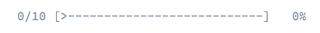

Progress Bar
############

When executing longer-running commands, it may be helpful to show progress information,
which updates as your command runs:

To display progress details, use the ``progress_bar()`` method (which returns a ``ProgressBar`` instance),
pass it a total number of units, and advance the progress as the command executes:

.. code-block:: python

    def handle(self):
        # Create a new progress bar (50 units)
        progress = self.progress_bar(50)

        # Start and displays the progress bar
        for _ in range(50):
            # ... do some work

            # Advance the progress bar 1 unit
            progress.advance()

            # You can also advance the progress bar by more than 1 unit
            # progress.advance(3)

        # Ensure that the progress bar is at 100%
        progress.finish()

Instead of advancing the bar by a number of steps (with the ``advance()`` method),
you can also set the current progress by calling the ``set_progress()`` method.

.. tip::

    If your platform doesn't support ANSI codes, updates to the progress bar are added as new lines.
    To prevent the output from being flooded, adjust the ``set_redraw_frequency()`` accordingly.
    By default, when using a ``max``, the redraw frequency is set to *10%* of your ``max``.

If you don't know the number of steps in advance,
just omit the steps argument when using the ``progress_bar`` method:

.. code-block:: python

    progress = self.progress_bar()

The progress will then be displayed as a throbber:

.. code-block:: text

    # no max steps (displays it like a throbber)
       0 [>---------------------------]
       5 [----->----------------------]
       5 [============================]

    # max steps defined
     0/3 [>---------------------------]   0%
     1/3 [=========>------------------]  33%
     3/3 [============================] 100%

Whenever your task is finished, don't forget to call ``finish()``
to ensure that the progress bar display is refreshed with a 100% completion.

.. note::

    If you want to output something while the progress bar is running, call ``clear()`` first.
    After you're done, call ``display()`` to show the progress bar again.

Customizing the Progress Bar
============================

Built-in Formats
----------------

By default, the information rendered on a progress bar depends
on the current level of verbosity of the ``IO`` instance:

.. code-block:: text

    # Verbosity.NORMAL (CLI with no verbosity flag)
     0/3 [>---------------------------]   0%
     1/3 [=========>------------------]  33%
     3/3 [============================] 100%

    # Verbosity.VERBOSE (-v)
     0/3 [>---------------------------]   0%  1 sec
     1/3 [=========>------------------]  33%  1 sec
     3/3 [============================] 100%  1 sec

    # Verbosity.VERY_VERBOSE (-vv)
     0/3 [>---------------------------]   0%  1 sec
     1/3 [=========>------------------]  33%  1 sec
     3/3 [============================] 100%  1 sec

    # Verbosity.DEBUG (-vvv)
     0/3 [>---------------------------]   0%  1 sec/1 sec  1.0 MB
     1/3 [=========>------------------]  33%  1 sec/1 sec  1.0 MB
     3/3 [============================] 100%  1 sec/1 sec  1.0 MB

.. note::

    If you call a command with the quiet flag (``-q``), the progress bar won't be displayed.

Instead of relying on the verbosity mode of the current command,
you can also force a format via ``set_format()``:

.. code-block:: python

    progress.set_format('verbose')

The built-in formats are the following:

* ``normal``
* ``verbose``
* ``very_verbose``
* ``debug``

If you don't set the number of steps for your progress bar, use the ``_nomax`` variants:

* ``normal_nomax``
* ``verbose_nomax``
* ``very_verbose_nomax``
* ``debug_nomax``

Custom Formats
--------------

Instead of using the built-in formats, you can also set your own:

.. code-block:: python

    progress.set_format('%bar%')

This sets the format to only display the progress bar itself:

.. code-block:: text

    >---------------------------
    =========>------------------
    ============================

A progress bar format is a string that contains specific placeholders
(a name enclosed with the ``%`` character); the placeholders are replaced based
on the current progress of the bar. Here is a list of the built-in placeholders:

* ``current``: The current step
* ``max``: The maximum number of steps (or 0 if no max is defined)
* ``bar``: The bar itself
* ``percent``: The percentage of completion (not available if no max is defined)
* ``elapsed``: The time elapsed since the start of the progress bar
* ``remaining``: The remaining time to complete the task (not available if no max is defined)
* ``estimated``: The estimated time to complete the task (not available if no max is defined)
* ``memory``: The current memory usage
* ``message``: The current message attached to the progress bar

For instance, here is how you could set the format to be the same as the ``debug`` one:

.. code-block:: python

    progress.set_format(' %current%/%max% [%bar%] %percent:3s%% %elapsed:6s%/%estimated:-6s% %memory:6s%')

Notice the ``:6s`` part added to some placeholders?
That's how you can tweak the appearance of the bar (formatting and alignment).
The part after the colon (``:``) is used to set the format of the string.

The ``message`` placeholder is a bit special as you must set the value yourself:

.. code-block:: python

    progress.set_message('Task starts')
    progress.start()

    progress.set_message('Task in progress...')
    progress.advance()

    # ...

    progress.set_message('Task is finished')
    progress.finish()

Bar Settings
------------

Amongst the placeholders, ``bar`` is a bit special as all the characters used to display it can be customized:

.. code-block:: python

    # the finished part of the bar
    progress.set_bar_character('<comment>=</comment>')

    # the unfinished part of the bar
    progress.set_empty_bar_character(' ')

    # the progress character
    progress.set_progress_character('|')

    # the bar width
    progress.set_bar_width(50)

.. warning::

    For performance reasons, be careful if you set the total number of steps
    to a high number. For example, if you're iterating over a large number of
    items, consider setting the redraw frequency to a higher value by calling
    ``ProgressHelper.set_redraw_frequency()``, so it updates on only some iterations:

    .. code-block:: python

        progress.start(50000)

        # update every 100 iterations
        progress.set_redraw_frequency(100)

        for _ in range(50000)
            # ... do some work

            progress.advance()
